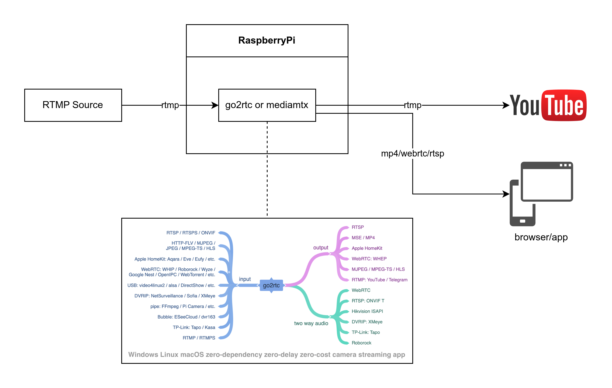

# BSV Local Streaming

Using Go2rtc to stream RTMP stream to:

- Publish to YouTube via RTMPS

- Publish to mutliple local clients via HTTPS, Secured Websocket, WebRTC, and RTSP.



## How to Run

### Go2rtc (v1.9.9)

\[[documentation](https://github.com/AlexxIT/go2rtc)\]

Install the necessary dependencies:

```bash
sudo apt update && sudo apt install wget github
```

Clone the repository from github:

```bash
git clone <github-repository> .

# Navigate to the cloned repository folder
cd ./<github-repository folder>
```

Run the script:

```bash
./run_go2rtc.sh
```

The script will run the following tasks:

1. Check the OS architecture

2. Check if the binary file is installed

3. Install the binary file if not installed

4. Check if the `config.yaml` file exist

5. Create a default `config.yaml` file if not exist

6. Create the necessary folders

### Setup Firewall

Install UFW:

```bash
sudo ufw update && sudo apt install ufw
```

Setup:

```bash
# Enable UFW service on startup
sudo ufw enable
```

Add permissions:

```bash
sudo ufw add openssh # Port SSH 22
sudo ufw add https # Port HTTPS 443
```

### Setup TLS Certificate

\[[source](https://www.linode.com/docs/guides/create-a-self-signed-tls-certificate/)\]

Install OpenSSL:

```bash
sudo ufw update && sudo apt install openssl
```

Create the certificate:

```bash
# Flags:
#   -newkey rsa:4096: use 4096 bit RSA key for the certificate
#   -x509: self signed certificate
#   -sha256: generate certificate request using 256-bit SHA
#   -days: time length(in days) of the intended use of certificate
#   -nodes: does not require passphrase (which will be asked each time the application using it is restarted) 
openssl req -new -newkey rsa:4096 -x509 -sha256 -days 365 -nodes -out ./certs/MyCertificate.crt -keyout ./certs/MyKey.key

# Update permission
chmod 400 ./certs/MyKey.key
```


